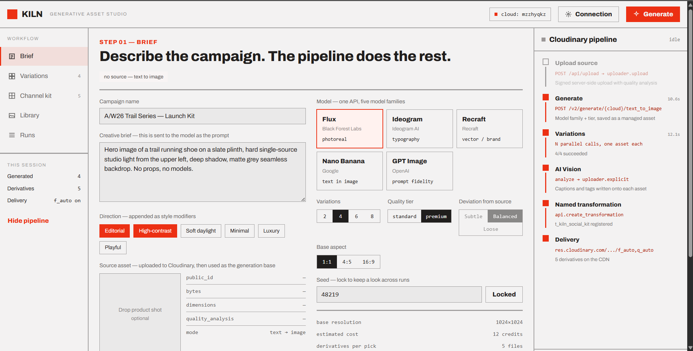
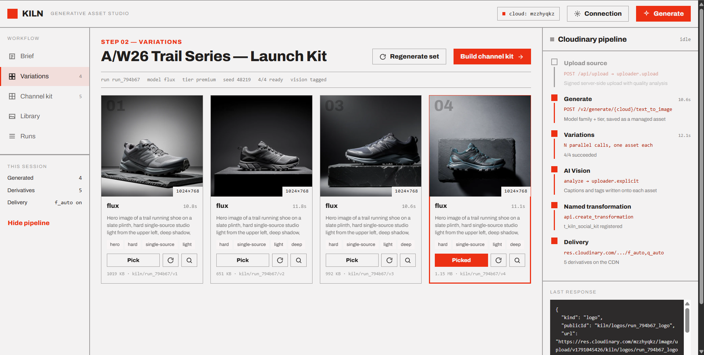
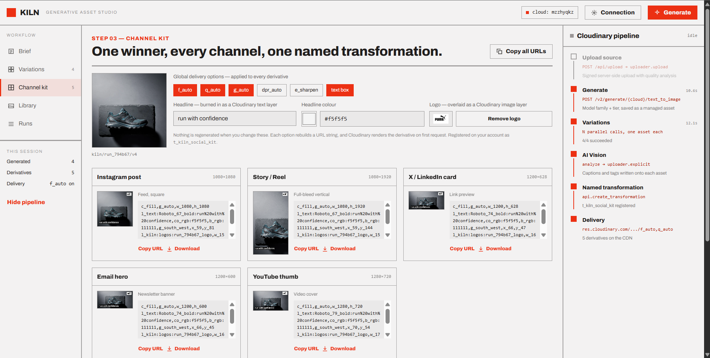
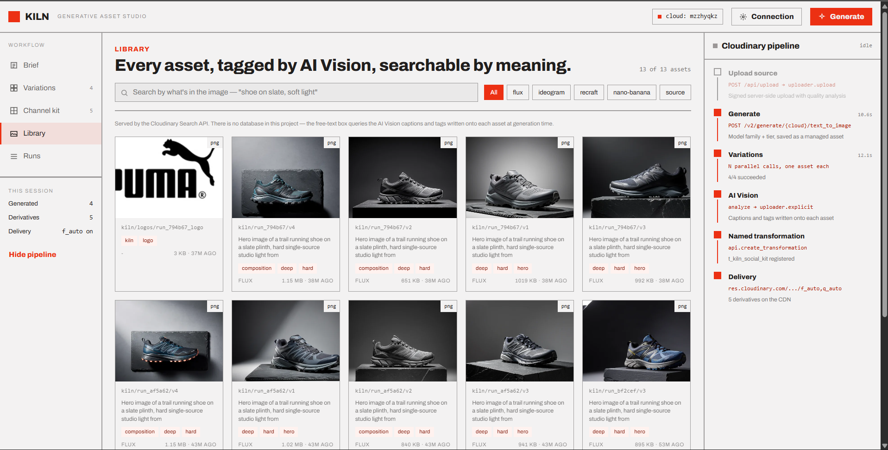

# Kiln Studio

**Brief in, full campaign kit out — generated, managed and delivered entirely on Cloudinary.**

Describe a campaign once. Kiln generates image variations through Cloudinary's
Image Generation API with a choice of AI model family, tags every result with AI
Vision, and derives every social channel size from the winner as a pure URL
transformation — then serves the lot from the CDN.

**There is no database in this project.** Cloudinary is the engine, the datastore
and the CDN.

| | |
|---|---|
| **Track** | PS-02 · Track 2 — Generative Content Workflows |
| **Live demo** | _add your Vercel URL_ |
| **Demo video** | _add your video URL_ |
| **Stack** | Next.js 16 · TypeScript · Cloudinary · Vercel |

---



## The problem

A brand launching one product needs the same hero image in five shapes — square
for Instagram, 9:16 for Stories, 1.91:1 for a link card, a wide email banner, a
video thumbnail — plus alt text for every one of them.

Today that is a designer, a day of cropping, and a folder of near-duplicate files
nobody can search a month later.

The usual "AI image generator" does not fix it. It hands you a PNG and stops. The
work *after* the image is generated is the actual work.

**Kiln makes the generated image the start of a pipeline instead of the end of one.**

---

## How it works

| Step | Screen | What happens |
|---|---|---|
| **01** | Brief | Write the brief, pick a model family and tier, optionally drop in a product shot. The source is uploaded to Cloudinary with quality analysis. |
| **02** | Variations | N variations generate in parallel, each saved as a managed Cloudinary asset. Every result is captioned and tagged as it lands. |
| **03** | Channel kit | Pick a winner. Every channel size is derived from that one asset by URL transformation. Change the headline and all five rebuild instantly — nothing regenerated. |
| — | Library | Every asset ever made, searched through the Cloudinary Search API. |
| — | Runs | Pipeline history, reconstructed from context metadata on the assets. |

A live pipeline rail down the right-hand side traces each Cloudinary call as it
fires, with timings and the raw response JSON.

### Step 02 — variations, each one a managed asset



Four variations from one brief, generated in parallel on Flux. Each card shows the
model, the time it took, its caption and tags, and its Cloudinary public ID.

### Step 03 — one winner, every channel



The transformation chain is printed under every derivative, because that is the
point: these are not five generated images, they are five URLs pointing at one
asset. Type in the headline box and all five rebuild without a single API call.

### Library — searchable by what is in the image



No database. This grid is a live Cloudinary Search API query over tags and the
captions written onto each asset at generation time.

---

## How Cloudinary is used

| Capability | Where | Code |
|---|---|---|
| **Image Generation API** | Step 02 — text-to-image from the brief, saved as a managed asset | `lib/imagegen.ts` |
| **Model choice** | Flux · Ideogram · Recraft · Nano Banana · GPT Image, standard or premium tier, per request | `lib/types.ts` |
| **Generative variations** | N per run, each with its own seed and prompt angle; per-card re-roll | `lib/prompt.ts` |
| **Generative transformations** | Fallback path — `e_gen_background_replace` re-stages an uploaded product shot | `lib/imagegen.ts` |
| **AI Vision** | Caption and tags for every asset, written back onto the asset | `lib/vision.ts` |
| **Upload API** | Signed server-side upload of the source shot and logo, with `quality_analysis` | `app/api/upload/route.ts` |
| **Image transformations** | `c_fill,g_auto` smart crop · `l_text` headline · `b_rgb` text panel · `l_<logo>` image layer · `fl_attachment` | `lib/transforms.ts` |
| **Named transformations** | The kit registers as `t_kiln_social_kit` | `lib/transforms.ts` |
| **Search API** | The entire Library screen | `app/api/library/route.ts` |
| **Context metadata** | Run history on the Runs screen | `lib/runs.ts` |
| **Optimisation & delivery** | `f_auto`, `q_auto`, `dpr_auto` on every derivative, CDN-served | `lib/transforms.ts` |

### The line that matters

```ts
target: {
  target_type: "managed_asset",
  public_id: args.publicId,
  tags: args.tags,
}
```

That is what makes this a pipeline rather than a wrapper. The generated image is
not a temporary output to download — it becomes a first-class Cloudinary asset,
immediately transformable, searchable and deliverable.

---

## Running it locally

```bash
git clone <your-repo-url>
cd kiln-studio
npm install
cp .env.example .env.local     # fill in your three Cloudinary values
npm run verify                 # proves the pipeline against your account
npm run dev                    # http://localhost:3000
```

### Cloudinary setup

1. Create a free account at [cloudinary.com](https://cloudinary.com).
2. **Settings → Add-ons** — enable **Cloudinary Image Generation** and
   **Cloudinary AI Vision**.
3. **Settings → API Keys** — copy your cloud name, API key and API secret into
   `.env.local`.

### `npm run verify`

Runs the whole pipeline once against your own account and prints a pass/fail
report — credentials, upload, metadata merge, generation, AI Vision,
transformation rendering, forced download, named transformation and search. It
creates a few assets under `kiln/_verify` and deletes them again (`--keep` to
retain them).

**Run this before recording a demo.** It answers the only question that matters in
about a minute: is this really talking to Cloudinary, or falling back to samples?

If a check fails it prints the failing URL and, for font problems, probes
alternatives and tells you exactly what to put in `.env.local`.

### It runs without credentials too

With no credentials, or `KILN_DEMO_MODE=true`, the app serves Cloudinary's public
`demo` cloud and shows a banner saying so. Every URL is still a real Cloudinary
delivery URL with a real transformation chain — only the generation step is
pre-baked, which is why the sample images will not match your brief.

Do not record a demo video in this mode.

### If the Image Generation add-on is unavailable

Upload a product shot on the Brief screen. Kiln falls back to generative
transformations (`e_gen_background_replace`) on that asset — standard Cloudinary,
no add-on required. Same pipeline, same outputs.

---

## How to test it

1. **Open the app.** The Brief screen is prefilled with a working example.
2. Click **Generate 4 variations**. Watch the pipeline rail light up step by step
   and the response JSON update with each call.
3. Variations appear **independently** as each finishes, with captions and tags.
4. Click **Pick**, then **Build channel kit**.
5. **Type in the Headline box.** Every derivative rebuilds live. Nothing is
   regenerated — the transformation string under each card shows the text layer
   joining the chain.
6. Drop a transparent PNG into the **Logo** slot. An `l_<logo>` layer appears on
   all five at once.
7. Toggle `f_auto` or `g_auto` and watch the chain change.
8. Open **Library**. Search any word from a caption. That query goes to the
   Cloudinary Search API, not a database.
9. Open **Runs** for history rebuilt from asset metadata.
10. **Connection → Test connection** reports which parts of the pipeline are live
    on your account.

### API routes

| Route | Method | Purpose |
|---|---|---|
| `/api/generate` | POST | Generate **one** variation |
| `/api/vision` | POST | Re-run AI Vision on an asset |
| `/api/upload` | POST | Signed upload of the source shot or logo |
| `/api/kit` | POST | Build the channel-kit transformation chains |
| `/api/library` | GET | Cloudinary Search |
| `/api/runs` | GET | Run history from context metadata |
| `/api/health` | GET | Credential and add-on status |

### Scripts

| Command | Does |
|---|---|
| `npm run dev` | Development server |
| `npm run build` | Production build |
| `npm run verify` | End-to-end Cloudinary account check |
| `npm run typecheck` | `tsc --noEmit` |

---

## Deploying to Vercel

1. Push to GitHub.
2. Import at [vercel.com/new](https://vercel.com/new). Framework detection handles
   the build — no overrides.
3. **Settings → Environment Variables** — add the three `CLOUDINARY_*` values for
   all environments.
4. Deploy, then open the live URL and confirm **no demo banner** appears. A banner
   means the env vars did not save; that is the most common deployment mistake.

### One design decision worth knowing

`/api/generate` generates **one image per request**, and the browser fires N
requests in parallel.

A single serverless invocation generating six images in sequence would take two to
four minutes and hit Vercel's function timeout every time. One image per
invocation keeps each call short, lets variations stream into the UI as they
finish, and means a single slow model does not take the run down with it. Each
route sets `maxDuration` and runs on the Node runtime, which the Cloudinary SDK
requires.

---

## Project structure

```
app/
  page.tsx            Studio shell
  layout.tsx
  ds.css              Modernist design-system tokens
  app.css
  api/                7 route handlers
components/
  Studio.tsx          State, parallel generation, pipeline tracking
  BriefScreen.tsx     Step 01
  VariantsScreen.tsx  Step 02
  KitScreen.tsx       Step 03
  LibraryScreen.tsx   Cloudinary Search
  RunsScreen.tsx      History
  PipelineRail.tsx    Live call trace
  SettingsDialog.tsx  Connection + health
lib/
  cloudinary.ts       SDK config, delivery URL builder
  imagegen.ts         Image Generation API + generative-transform fallback
  transforms.ts       Channel kit, named transformation, code snippets
  vision.ts           AI Vision with graceful degradation
  prompt.ts           Brief → prompt
  runs.ts             History from context metadata
  demo.ts             Sample-asset fallback
  client.ts           Browser API helpers
  types.ts            Shared contract
scripts/
  verify.mjs          End-to-end account verification
```

---

## Notes and limitations

Stated plainly rather than discovered later:

- **The Image Generation API is an early-access add-on.** Its base URL lives in one
  constant (`CLOUDINARY_IMAGEGEN_BASE`) and the response is parsed defensively, so
  a change in shape does not break the app.
- **Text-layer fonts.** The headline uses **Roboto**, a Cloudinary built-in. Google
  Fonts work via an `@google` suffix but *not* together with the `bold` keyword:
  Cloudinary forwards the weight to the Google Fonts API, which accepts only
  numeric weights, so `Archivo@google_67_bold` builds the invalid request
  `family=Archivo:wght@bold` and every derivative returns HTTP 400. Set
  `KILN_TEXT_FONT` and `KILN_TEXT_WEIGHT` together; `npm run verify` probes which
  combinations render on your account.
- **Metadata writes merge, never replace.** Tags and context use `add_tag` /
  `add_context`, not `uploader.explicit` — passing `tags` to `explicit` replaces
  the whole set, which would erase the `kiln` tag and `run_id` written at
  generation time and silently empty the Library and Runs screens.
- **Uploads are capped at 4 MB**, because Vercel rejects serverless request bodies
  above roughly 4.5 MB at the platform edge, before the route runs.
- **`vercel.json` sets no `regions`.** Region pinning is a paid-plan feature and
  fails a Hobby deployment; timeouts come from `maxDuration` in each route.
- **If the AI Vision add-on is not enabled**, captions and tags fall back to
  keywords extracted from your own prompt. Library search still works — it just
  searches those keywords instead of a generated description.
- Generation is credit-based. Budget before a live demo, and keep
  `KILN_DEMO_MODE` in reserve.

---

## Credits

Design system: **Modernist** (`app/ds.css`).
Built for the Cloudinary hackathon — Track 2, Generative Content Workflows.

Licensed under the [MIT License](LICENSE).
